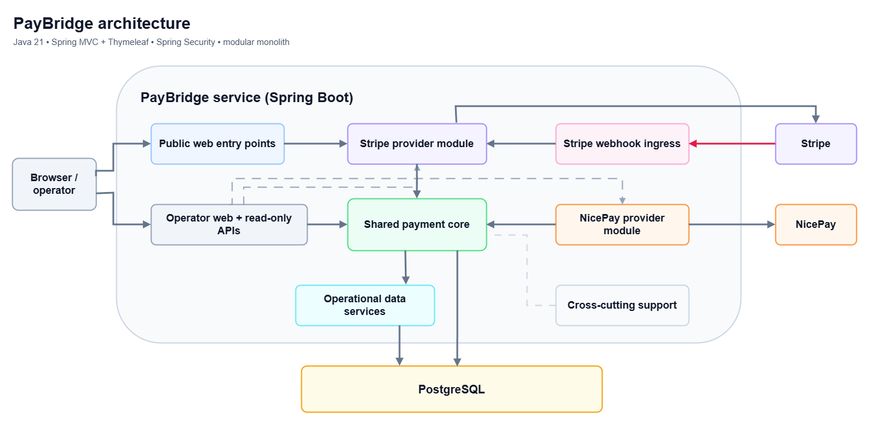
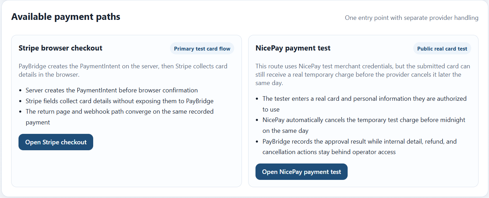
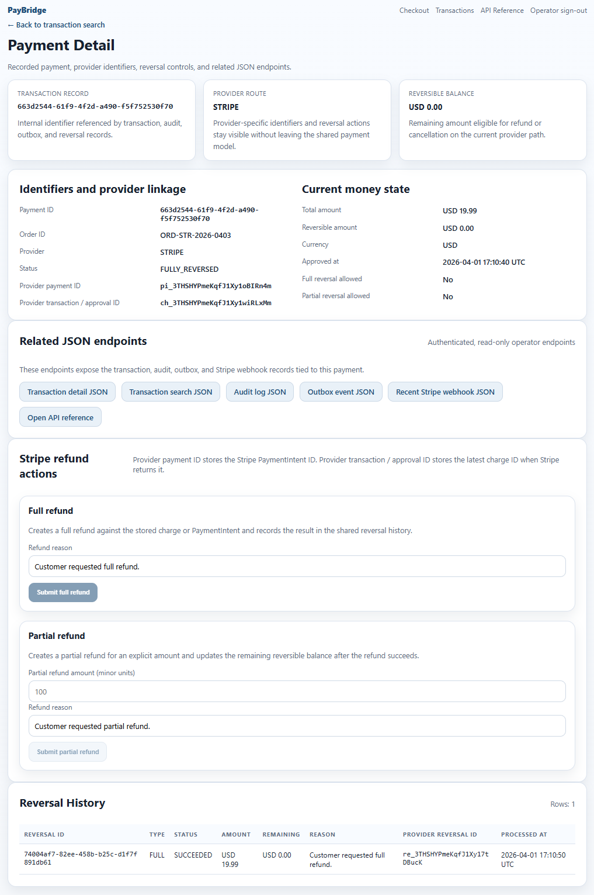
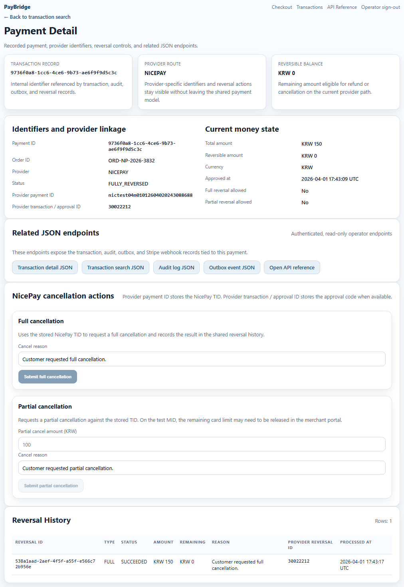

# PayBridge

[](LICENSE)

PayBridge is a backend-heavy personal project that keeps one payment lifecycle across two very different providers while preserving provider-specific behavior at the module boundary.

PayBridge keeps one payment lifecycle across two very different providers:

- **Stripe** — PaymentIntents, Payment Element confirmation, refunds, and webhooks
- **NicePay** — a merchant-hosted keyed-entry card flow, EUC-KR form posting, provider-specific signing, and cancellation APIs

The point of the project is not “how do I call two payment SDKs?” It is “how do I keep approval, reversal, and transaction visibility consistent when provider behavior is not symmetric?”

---
## Table of Contents
- [Demo walkthrough](#demo-walkthrough)
- [Why I built this](#why-i-built-this)
- [What this project demonstrates](#what-this-project-demonstrates)
- [Architecture at a glance](#architecture-at-a-glance)
- [System overview](#system-overview)
- [Why Stripe and NicePay together matter](#why-stripe-and-nicepay-together-matter)
- [Main flows](#main-flows)
- [Repository map](#repository-map)
- [Local run](#local-run)
- [Routes](#routes)
- [Interface snapshots](#interface-snapshots)
- [Manual smoke test](#manual-smoke-test)
- [Reliability and security highlights](#reliability-and-security-highlights)
- [Testing](#testing)
- [Design decisions worth discussing](#design-decisions-worth-discussing)
- [Additional docs](#additional-docs)
- [Scope and non-goals](#scope-and-non-goals)
- [Note](#note)

---

## Demo walkthrough


<p align="center">
  
</p>

<p align="center">
  <sub><strong>Demo scope:</strong> checkout selection → Stripe test payment → payment detail → full refund → operator transaction search.</sub>
</p>

---
## Why I built this

I built PayBridge to show how I think about real payment-system problems as a backend engineer. The project is informed by early-career work around keyed-entry card payments and by wanting a portfolio project that contrasts that model with Stripe’s PaymentIntent + webhook approach.

That combination makes the project useful for two kinds of roles:

- **Payment / fintech backend roles** — because it deals with provider heterogeneity, reversal semantics, idempotency, webhook retries, auditability, and operational traceability
- **General backend / SWE roles** — because it shows modular design, transactional consistency, clear boundaries, local developer experience, testing, and API/UI integration in one repository

---
## What this project demonstrates

### For payment and fintech roles

- A **shared payment and reversal model** across providers with very different approval and reversal contracts
- **Idempotent write paths** for approvals and reversals
- **Duplicate-safe Stripe webhook handling** using signature verification plus provider-scoped uniqueness
- An explicit **provider boundary** so Stripe and NicePay differences stay inside provider modules and transport/client code instead of leaking into the shared payment model
- Practical handling of **partial reversals**, **provider identifiers**, and **operator-facing transaction inspection**

### For general backend roles

- A **modular monolith** with packages organized around domain, provider, and operator boundaries
- Consistent transactional side effects through **audit logs** and a **transactional outbox**
- A small but realistic **read-only operator API** plus server-rendered pages for manual workflows
- Clear **configuration, feature flags, security defaults, and local run paths**
- Shared **cross-cutting support** for validation, error handling, logging, metrics, masking, and correlation IDs
- Coverage across **unit, MVC/controller, and PostgreSQL/Testcontainers integration tests**

---
## Architecture at a glance

| Category | Choice |
| --- | --- |
| Language / runtime | Java 21 |
| Framework | Spring Boot 3.5.12 |
| Architecture style | Modular monolith |
| UI | Spring MVC + Thymeleaf + minimal JavaScript |
| Database | PostgreSQL 16 |
| Schema management | Flyway |
| Payment providers | Stripe, NicePay |
| Reliability controls | Idempotency keys, webhook dedupe, audit logs, outbox rows |
| Cross-cutting support | Spring Security, validation, error handling, masked logging, correlation IDs, Micrometer + Prometheus, OpenAPI |
| Testing | JUnit 5, Spring test slices, Testcontainers |
| CI | GitHub Actions |

---
## System overview
<p align="center">
  
</p>

<p align="center">
  <sub><strong>Architecture view:</strong> high-level component view of one Spring Boot service. Public checkout, operator pages, and Stripe webhook ingress terminate inside the same app; provider-specific logic stays inside the Stripe and NicePay modules; the shared payment core records approvals and reversals; operational data services expose audit, outbox, and webhook reads; PostgreSQL persists lifecycle state; and shared support covers security, validation, masking, correlation IDs, metrics, and OpenAPI.</sub>
</p>

---
## Why Stripe and NicePay together matter

| Concern | Stripe | NicePay | Shared outcome in PayBridge |
| --- | --- | --- | --- |
| Approval path | PaymentIntent + browser confirmation | Merchant-hosted keyed-entry approval request | One approved `Payment` record |
| Reversal path | Refund API | Cancellation API | One `PaymentReversal` model |
| Async behavior | Webhook follow-up and retries | Mostly synchronous approval/cancel response flow | Shared payment lifecycle visibility |
| Provider-specific concerns | Hosted fields, webhook signature verification | EUC-KR posting, request signing, provider response signature verification | Differences stay in provider modules |
| Operator needs | Search, inspect, refund, confirm replay safety | Search, inspect, full/partial cancellation | Same transaction search and detail surface |

---
## Main flows

### 1) Stripe checkout

1. The browser reaches the public checkout surface and opens `/payments/stripe/checkout`.
2. PayBridge creates a Stripe PaymentIntent on the server through the Stripe provider module.
3. Stripe.js confirms the payment in the browser.
4. The return page calls back into PayBridge at `/payments/stripe/return`.
5. PayBridge retrieves the PaymentIntent, records the payment once in the shared payment core, and persists audit/outbox rows.
6. If Stripe later sends a webhook for the same payment event, PayBridge converges on the same transaction record instead of creating a duplicate.

### 2) Stripe webhook handling

1. Stripe sends an event to `/api/providers/stripe/webhooks`.
2. PayBridge verifies the Stripe signature at a dedicated webhook ingress.
3. The webhook event is stored with a uniqueness guard on `(provider, provider_event_id)`.
4. A duplicate delivery returns a safe acknowledgement without replaying the business mutation.
5. Audit and outbox rows preserve what happened, and `payment_intent.succeeded` can converge on the same recorded payment.

### 3) NicePay keyed-entry approval

1. An authenticated operator opens `/payments/nicepay/keyin` when local-only mode is enabled.
2. PayBridge validates the form, encrypts the keyed-entry payload, and signs the provider request.
3. NicePay approval data is mapped into the shared payment model.
4. Full and partial cancellations reuse the same payment/reversal lifecycle used elsewhere in the app.

### 4) Operator workflow

1. Search by order id or provider identifiers at `/ops/transactions/search`.
2. Open `/payments/{paymentId}` to inspect lifecycle state and reversal history.
3. Use refund/cancel actions from the detail page.
4. Review related JSON endpoints for transactions, audit logs, outbox events, and recent Stripe webhooks.

---
## Repository map

- [`src/main/java/com/paybridge/web`](src/main/java/com/paybridge/web) — home page, checkout selection, and system info endpoint
- [`src/main/java/com/paybridge/operator`](src/main/java/com/paybridge/operator) — operator login and read-only JSON API controllers
- [`src/main/java/com/paybridge/payment`](src/main/java/com/paybridge/payment) — shared payment domain, commands, queries, persistence mapping, and operator payment search/detail views
- [`src/main/java/com/paybridge/providers/stripe`](src/main/java/com/paybridge/providers/stripe) — Stripe checkout, confirmation, refunds, webhook flow, and MVC pages
- [`src/main/java/com/paybridge/providers/nicepay`](src/main/java/com/paybridge/providers/nicepay) — NicePay approval, cancellation, crypto helpers, and EUC-KR form handling
- [`src/main/java/com/paybridge/audit`](src/main/java/com/paybridge/audit) — audit persistence, write/query services, and API view models used by operator inspection endpoints
- [`src/main/java/com/paybridge/ops/outbox`](src/main/java/com/paybridge/ops/outbox) — transactional outbox persistence, query services, and API view models used by operator inspection endpoints
- [`src/main/java/com/paybridge/support`](src/main/java/com/paybridge/support) — security, configuration, validation, error handling, logging, metrics, and OpenAPI wiring
- [`src/main/resources/templates`](src/main/resources/templates) — server-rendered pages
- [`docs/adr`](docs/adr) — architecture decisions
- [`docs/project-notes/paybridge-project-overview.md`](docs/project-notes/paybridge-project-overview.md) — technical walkthrough for code review
- [`docs/runbooks/local-operator-runbook.md`](docs/runbooks/local-operator-runbook.md) — local setup and smoke-test guide
- [`docs/openapi/paybridge-public.yaml`](docs/openapi/paybridge-public.yaml) — checked-in OpenAPI reference for JSON endpoints

---
## Local run

### Fastest path: local JVM + Dockerized Postgres

```bash
cp .env.example .env
./scripts/dev/bootstrap.sh db

# Important:
# .env is used by Docker Compose, but `bootRun` does not automatically read it.
# Export the variables in your shell or configure them in your IDE before starting the app.

export PAYBRIDGE_DB_URL=jdbc:postgresql://localhost:5432/paybridge
export PAYBRIDGE_DB_USERNAME=paybridge
export PAYBRIDGE_DB_PASSWORD=paybridge
export PAYBRIDGE_OPERATOR_USERNAME=operator
export PAYBRIDGE_OPERATOR_PASSWORD=operator-change-me

./gradlew bootRun --args="--spring.profiles.active=local"
```

### Alternative: full Docker Compose stack

```bash
cp .env.example .env
# edit .env if you want Stripe or NicePay enabled
./scripts/dev/bootstrap.sh full
```

### Required configuration by scenario

| Scenario | Required variables |
| --- | --- |
| Minimal local app | `PAYBRIDGE_DB_URL`, `PAYBRIDGE_DB_USERNAME`, `PAYBRIDGE_DB_PASSWORD` |
| Operator login | `PAYBRIDGE_OPERATOR_USERNAME`, `PAYBRIDGE_OPERATOR_PASSWORD` |
| Stripe checkout | `PAYBRIDGE_STRIPE_ENABLED=true`, `PAYBRIDGE_STRIPE_PROVIDER_ENABLED=true`, `PAYBRIDGE_STRIPE_PUBLISHABLE_KEY`, `PAYBRIDGE_STRIPE_SECRET_KEY` |
| Stripe webhook verification | `PAYBRIDGE_STRIPE_WEBHOOK_SECRET` |
| NicePay local flow | `PAYBRIDGE_NICEPAY_ENABLED=true`, `PAYBRIDGE_NICEPAY_PROVIDER_ENABLED=true`, `PAYBRIDGE_NICEPAY_MID`, `PAYBRIDGE_NICEPAY_MERCHANT_KEY` |

See [`.env.example`](.env.example) and [`src/main/resources/application.yml`](src/main/resources/application.yml) for the full configuration surface.


---
## Routes

| Route | Purpose | Auth |
| --- | --- | --- |
| `/` | Home / overview page | Public |
| `/checkout` | Choose provider-specific flow | Public |
| `/operator/login` | Operator sign-in page | Public |
| `/operator/logout` | Operator sign-out endpoint | Authenticated operator session |
| `/payments/stripe/checkout` | Stripe checkout page | Public |
| `/payments/nicepay/keyin` | NicePay keyed-entry flow | Operator by default; public only if local-only mode is disabled |
| `/ops/transactions/search` | Transaction search | Operator |
| `/payments/{paymentId}` | Payment detail + reversal actions | Operator |
| `/api/ops/transactions` | Read-only transaction search JSON API | Operator in local/dev; disabled in prod profile |
| `/api/ops/transactions/{paymentId}` | Read-only transaction detail JSON API | Operator in local/dev; disabled in prod profile |
| `/api/ops/transactions/{paymentId}/audit-logs` | Audit log JSON API | Operator in local/dev; disabled in prod profile |
| `/api/ops/transactions/{paymentId}/outbox-events` | Outbox JSON API | Operator in local/dev; disabled in prod profile |
| `/api/ops/stripe-webhooks` | Recent Stripe webhook events | Operator in local/dev; disabled in prod profile |
| `/api/system/info` | Runtime metadata JSON endpoint | Public |
| `/swagger-ui/index.html` | Runtime OpenAPI UI | Public in local/dev; disabled in prod profile |
| `/api-docs` | Runtime OpenAPI JSON | Public in local/dev; disabled in prod profile |
| `/actuator/prometheus` | Prometheus scrape endpoint | Authenticated |

---
## Interface snapshots

The snapshots below highlight the checkout selection page and representative payment-detail pages for the Stripe and NicePay paths.

### Checkout selection

<p align="center">
  
</p>

<p align="center">
  <sub><strong>UI snapshot:</strong> the public checkout page separates Stripe and NicePay flows while making the provider contrast easy to understand at a glance.</sub>
</p>

### Payment detail and reversal history

<p align="center">
  
</p>

<p align="center">
  <sub><strong>Operator view:</strong> one Stripe-backed payment record brings together provider linkage, current money state, related JSON inspection endpoints, refund controls, and reversal history. <br>In this example, a full refund has already succeeded, so the remaining reversible balance is USD 0.00 and the completed reversal is visible on the same page.</sub>
</p>

<br>

<details>
  <summary><strong>🖼️ Click to view Nicepay payment detail page </strong></summary>
  <p align="center">
    
  </p>
</details>

---
## Manual smoke test

1. Open the home page and verify the feature flags reflected in the UI.
2. Run a Stripe test payment from `/payments/stripe/checkout`.
3. Confirm that the return flow lands on the payment detail page.
4. Execute a Stripe partial refund and verify that reversal history updates.
5. Search by `orderId` at `/ops/transactions/search`.
6. If NicePay local credentials are configured, run a keyed-entry approval and then a full or partial cancellation.
7. Review `/api/ops/transactions/{paymentId}/audit-logs` and `/api/ops/transactions/{paymentId}/outbox-events`.

A more detailed checklist lives in [`docs/runbooks/local-operator-runbook.md`](docs/runbooks/local-operator-runbook.md).

---
## Reliability and security highlights

- **Idempotency keys** on approval and reversal write paths
- **Webhook duplicate suppression** for Stripe events
- **Transactional outbox rows** persisted with payment lifecycle changes
- **Audit logs** for approvals, reversals, webhook receipt, duplicate detection, and failures
- **Correlation IDs** propagated through request handling and error responses
- **Masked logging** for sensitive values and provider identifiers
- **Operator-only routes** for transaction search, payment detail, and NicePay local flows by default
- **Feature flags** to disable providers cleanly in local or production-like environments

---
## Testing

The project includes:

- domain tests for payment and reversal rules
- controller and form validation tests
- provider utility tests for Stripe and NicePay helpers
- PostgreSQL/Testcontainers integration tests for persistence, operator pages, webhook flow, and security behavior

GitHub Actions runs the Gradle test suite on push and pull request.

---
## Design decisions worth discussing

- [ADR-001 — modular monolith and provider boundaries](docs/adr/ADR-001-modular-monolith-and-provider-boundaries.md)
- [ADR-002 — outbox-first eventing](docs/adr/ADR-002-outbox-first-over-broker.md)
- [ADR-003 — server-rendered operator UI](docs/adr/ADR-003-server-rendered-operator-ui.md)

---
## Additional docs

- [Technical project overview](docs/project-notes/paybridge-project-overview.md)
- [Local runbook](docs/runbooks/local-operator-runbook.md)
- [OpenAPI notes](docs/openapi/README.md)
- [Checked-in OpenAPI spec](docs/openapi/paybridge-public.yaml)

---
## Scope and non-goals

PayBridge intentionally focuses on approval and reversal flows. It does **not** currently model:

- settlement and reconciliation
- disputes and chargebacks
- recurring billing and subscription management
- broker dispatch beyond persisted outbox rows
- production deployment and infrastructure automation
- multi-tenant auth, roles, or back-office entitlements

---
## Note

This repository is a portfolio project, not a claim of a production-ready payment gateway.

In particular:

- the NicePay keyed-entry page exists to model a provider-specific local/test flow
- raw card values are not intentionally persisted or logged
- the project should **not** be interpreted as end-to-end PCI implementation guidance
- security and reliability decisions are included to show engineering judgment, not to overstate production readiness

